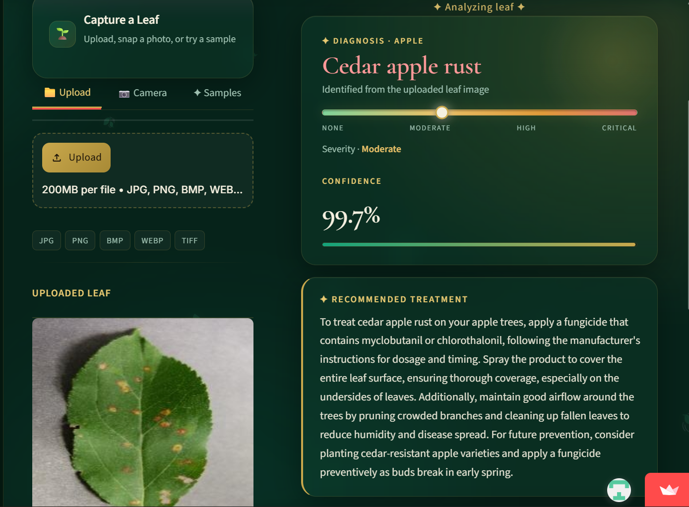
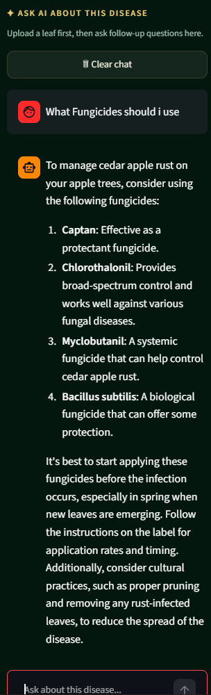
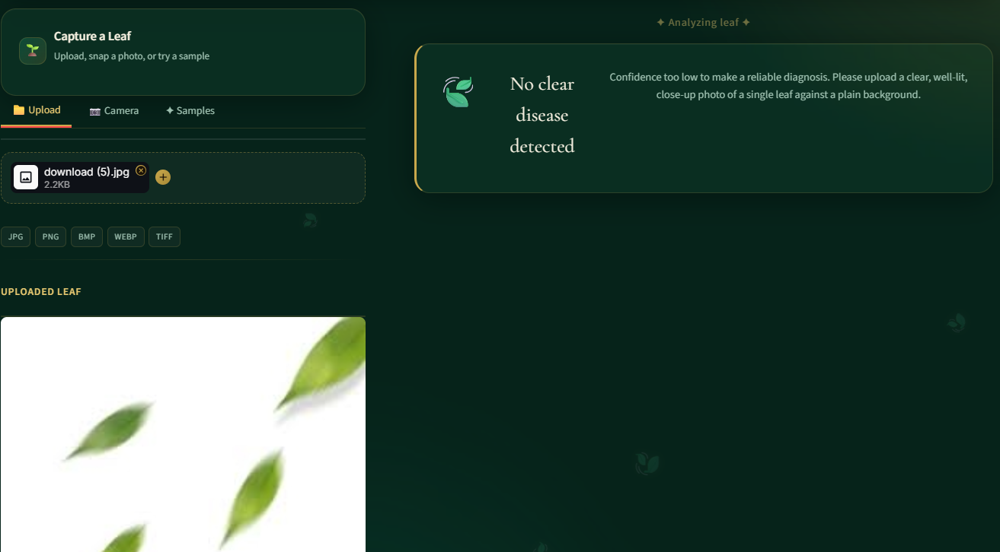
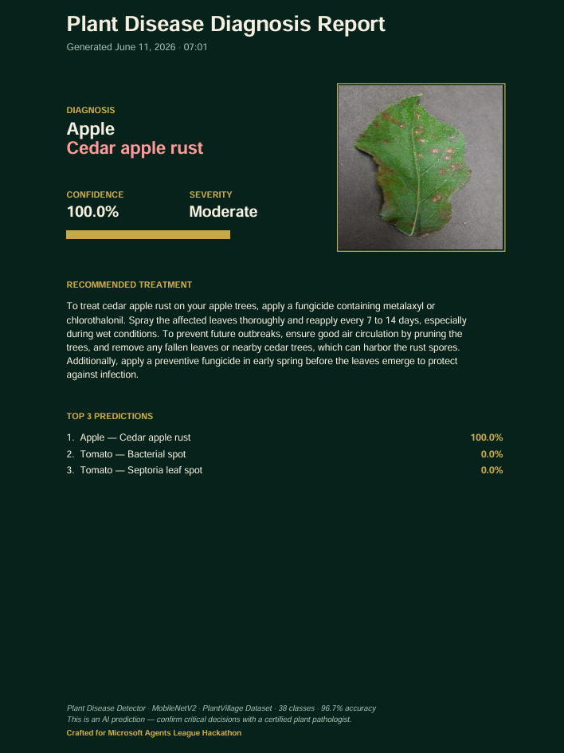

<div align="center">


</div>

#  AI Plant Disease Detector

> **Giving smallholder farmers instant AI-powered leaf disease diagnosis from a single smartphone photo — 38 diseases, 96.7% accuracy, live GPT-4o-mini treatment advice, and a conversational AI agent.**

<div align="center">


</div>

---

## Demo & Links

| | Link |
|---|---|
|  **Demo Video** | [Watch on YouTube](YOUR_YOUTUBE_LINK_HERE) |
|  **Live App** | [plant-disease-detector-rumman.streamlit.app](https://plant-disease-detector-rumman.streamlit.app) |
|  **W&B Training Dashboard** | [View Experiments](https://wandb.ai/uman66-meta/plant-disease-detector/workspace?nw=nwuseruman66) |
|  **Dataset** | [PlantVillage on Kaggle](https://www.kaggle.com/datasets/abdallahalidev/plantvillage-dataset) |
|  **Discord** | [Join Agents League Arena](https://aka.ms/agentsleague/discord) |

---

##  The Problem

Smallholder farmers lose **20–40% of their crops annually** to plant diseases.
In developing regions, access to plant pathologists is limited or nonexistent.
By the time a farmer gets an expert opinion, the disease has often spread.

**This app puts a plant pathologist in every farmer's pocket.**
A single smartphone photo is all it takes — instant diagnosis, severity rating,
AI-generated treatment plan, and a conversational agent to answer follow-up questions.

---

##  Features

| Feature | Description |
|---|---|
|  **AI Disease Detection** | MobileNetV2 model classifies plant diseases across 38 classes with 96.7% accuracy |
|  **Live AI Treatment Advice** | GPT-4o-mini generates personalized, farmer-friendly treatment recommendations via GitHub Models API |
|  **Sidebar AI Chat Agent** | Conversational agent with full disease context — ask follow-up questions after any diagnosis |
|  **Smart Confidence Threshold** | Rejects unclear images under 60% confidence with helpful re-upload guidance |
|  **Severity Gauge** | Visual scale rating disease severity from None → Moderate → High → Critical |
|  **Top-3 Predictions** | Shows the three most likely diseases with confidence bars for transparency |
|  **PDF & Text Report Download** | Branded diagnosis report with disease, severity, treatment, and top-3 predictions |
|  **Upload / Camera / Sample Tabs** | Supports file upload, live camera capture, or built-in sample images |
|  **Session Scan History** | Tracks your last 5 scans within the session |

##  Agentic Workflow

The agent operates as a **multi-step reasoning agent**, not just a classifier. Each diagnosis triggers a chain of AI decisions:

```
 User uploads leaf image
        ↓
 MobileNetV2 classifies disease across 38 classes
        ↓
  Confidence check — under 60%? → Reject with clear guidance (no hallucination)
        ↓  (over 60%)
 GitHub Models API (GPT-4o-mini) generates live, contextual treatment plan
        ↓
 Sidebar AI agent activates with full disease context
        ↓
 User asks follow-up questions → Agent answers with plant + disease awareness
        ↓
 Exportable diagnosis report (PDF or text)
```

The agent handles **uncertainty gracefully** — low confidence images are rejected rather than producing a wrong diagnosis, preventing harmful misinformation to farmers.

---

##  How GitHub Copilot Was Used

This project was built with **GitHub Copilot** as a core development tool, specifically for all hackathon-edition features:

- **GitHub Models API integration** — Copilot generated the API call structure, error handling, and fallback logic for the `get_ai_treatment()` function
- **Sidebar chat panel** — Copilot assisted in designing the session state management, chat bubble rendering, and context-passing between diagnosis and chat
- **Confidence threshold logic** — Copilot suggested the `st.stop()` pattern and the under-60% warning UI block
- **CSS styling refinements** — Copilot helped write the aurora background animation, shimmer border effect, and glassmorphism card CSS
- **Chat reset logic** — Copilot suggested the disease-context comparison pattern to auto-clear chat when a new disease is detected
- **PDF report generator** — Copilot helped structure `build_pdf_report()` using ReportLab, including dynamic layout for top-3 predictions and severity gauges

> GitHub Copilot was used in VS Code with the chat panel open throughout development. Prompts were written in natural language describing the desired behavior, and Copilot completions were reviewed, tested, and refined iteratively.

---

##  Architecture

```
┌─────────────────────────────────────────────────────────┐
│                    USER INTERFACE                        │
│              Streamlit Web Application                   │
│   [Upload Tab] [Camera Tab] [Samples Tab] [Sidebar Chat] │
└──────────────────────┬──────────────────────────────────┘
                       │ Leaf Image
                       ▼
┌─────────────────────────────────────────────────────────┐
│                 CONFIDENCE GATE                          │
│         < 60% → Reject + Show Guidance                  │
│         ≥ 60% → Continue to diagnosis                   │
└──────────────────────┬──────────────────────────────────┘
                       │
                       ▼
┌─────────────────────────────────────────────────────────┐
│              ML INFERENCE ENGINE                         │
│   MobileNetV2 (ImageNet pretrained) + Custom Head       │
│   Input: 224×224×3  │  Output: 38-class softmax         │
│   Top-3 predictions with confidence scores              │
└──────────────────────┬──────────────────────────────────┘
                       │ Top disease + confidence
                       ▼
┌─────────────────────────────────────────────────────────┐
│           GITHUB MODELS API  (GPT-4o-mini)              │
│   models.inference.ai.azure.com/chat/completions        │
│   Generates: Live treatment recommendation              │
│   Fallback: Static TREATMENTS dictionary                │
└──────────────────────┬──────────────────────────────────┘
                       │ Treatment + Disease Context
                       ▼
┌─────────────────────────────────────────────────────────┐
│           SIDEBAR CONVERSATIONAL AGENT                   │
│   Context: Plant + Disease + Confidence passed in       │
│   Memory: Session state (auto-resets on new disease)    │
│   Model: GPT-4o-mini via GitHub Models API              │
└─────────────────────────────────────────────────────────┘
```

### ML Model Architecture

```
Input (224×224×3)
│
├── Data Augmentation (RandomFlip, RandomRotation, RandomZoom, RandomContrast)
├── MobileNetV2 (ImageNet pretrained — frozen base)
├── GlobalAveragePooling2D
├── Dropout
├── Dense(128, ReLU)
├── Dropout
└── Dense(38, Softmax)
```

| Layer | Output Shape |
|---|---|
| MobileNetV2 | (7, 7, 1280) |
| GlobalAveragePooling2D | (1280) |
| Dense Layer | (128) |
| Output Layer | (38) |

| Parameter Type | Count |
|---|---|
| Total Parameters | 2,426,854 |
| Trainable Parameters | 894,310 |
| Model Size | 9.26 MB |

---

##  Model Performance

### Final Transfer Learning Model (MobileNetV2)

| Metric | Value |
|---|---|
| Validation Accuracy | **96.66%** |
| Training Accuracy | 96.92% |
| Validation Loss | 0.0995 |
| Macro F1 Score | 0.95 |
| Weighted F1 Score | 0.96 |
| Classes | 38 |
| Input Size | 224 × 224 |
| Epochs | 20 |
| Framework | TensorFlow / Keras |

### Baseline CNN vs. Transfer Learning

| Metric | Basic CNN | MobileNetV2 |
|---|---|---|
| Accuracy | 84% | **96.7%** |
| Minority Class Performance | Weak | Improved |
| Feature Extraction | Learned from scratch | Pretrained ImageNet |
| Generalization | Moderate | Strong |

---

## 📸 Screenshots

### Disease Detected — High Confidence

*MobileNetV2 detects disease with confidence score, severity gauge, and live AI treatment*

### AI Sidebar Chat

*Conversational AI agent answers follow-up questions with full disease context*

### Low Confidence Warning

*Smart rejection when image quality is too low — no false diagnoses*

### PDF Report

*Downloadable diagnosis report with treatment plan and top-3 predictions*
---

##  Tech Stack

| Layer | Technology |
|---|---|
| ML Framework | TensorFlow / Keras |
| Model Architecture | MobileNetV2 (ImageNet pretrained) |
| AI Agent | GitHub Models API — GPT-4o-mini |
| Development Tool | GitHub Copilot (VS Code) |
| Web Framework | Streamlit 1.35 |
| Computer Vision | Pillow, OpenCV |
| Reporting | ReportLab |
| Experiment Tracking | Weights & Biases |
| Deployment | Streamlit Community Cloud |

---

##  Judging Criteria

| Criterion | Weight | How This App Addresses It |
|---|---|---|
| Accuracy & Relevance | 20% | 96.7% model accuracy · GitHub Models API for live AI · Solves real agricultural problem |
| Reasoning & Multi-step | 20% | 5-step pipeline: upload → classify → confidence gate → AI treatment → chat agent |
| Creativity & Originality | 15% | Combines CV model + live LLM + conversational agent in a single unified app |
| UX & Presentation | 15% | Glassmorphism UI · severity gauge · top-3 predictions · PDF export · sidebar chat |
| Reliability & Safety | 20% | Confidence threshold rejects unclear images · TREATMENTS fallback if API fails · error handling throughout |
| Community Vote | 10% | [Vote on Discord →](https://aka.ms/agentsleague/discord) |

---

##  Installation

> **Note:** The app runs without a GitHub token — it falls back to a built-in treatment database. For live AI treatments and the sidebar chatbot, follow the GitHub Token Setup section below.

### 1. Clone the repository

```bash
git clone https://github.com/Uman-66/plant-disease-detector.git
cd plant-disease-detector
```

### 2. Install dependencies

```bash
pip install -r requirements.txt
```

### 3. Run the app

```bash
streamlit run app/app.py
```

---

##  GitHub Token Setup (for AI Features)

The GitHub Models API powers the live treatment recommendations and sidebar chatbot. To enable these features:

**Step 1 — Create a GitHub Personal Access Token**
1. Go to [github.com/settings/tokens](https://github.com/settings/tokens)
2. Click **Generate new token (classic)**
3. Set any name (e.g. `plant-disease-app`), expiration: 90 days
4. Leave ALL scopes unchecked — no permissions needed
5. Click **Generate token** and copy it immediately

**Step 2 — Add to Streamlit secrets**

For local development, create `.streamlit/secrets.toml`:

```toml
GITHUB_TOKEN = "ghp_your_token_here"
```

For Streamlit Cloud deployment: go to your app → **Settings** → **Secrets** → paste the same line.

> ⚠️ Never commit your token to GitHub. Add `.streamlit/secrets.toml` to `.gitignore`

**Without a token:** The app still works — it shows treatment recommendations from the built-in database instead of live AI responses.

---

##  Project Structure

```
plant-disease-detector/
│
├── app/
│   ├── app.py                    ← Streamlit app (976 lines) — full agent pipeline
│   └── samples/                  ← Sample leaf images for demo (apple, grape)
│
├── models/
│   ├── plant_disease_model.keras ← MobileNetV2 transfer learning model (17MB)
│   └── basiccnn/
│       └── plant_disease_model.keras ← Baseline CNN for comparison (1.5MB)
│
├── notebooks/
│   ├── EDA.ipynb                 ← Exploratory data analysis
│   ├── basecnn.ipynb             ← Baseline CNN training
│   └── transfer_learning.ipynb  ← Final MobileNetV2 training
│
├── docs/
│   └── screenshots/              ← App screenshots for README
│
├── plots/
│   └── class_distribution.png
│
├── requirements.txt
├── LICENSE
└── README.md
```

---

##  Dataset Information

- **Source:** [PlantVillage Dataset on Kaggle](https://www.kaggle.com/datasets/abdallahalidev/plantvillage-dataset)
- **Images used:** RGB `color` folder only
- **Total classes:** 38
- **Image shape:** 256×256×3
- **Mean Pixel Value:** 0.4623 · **Std Dev:** 0.1842
- **Class imbalance ratio:** 36.23 (handled via `compute_class_weight`)

---

##  Training Strategy

| Callback | Configuration |
|---|---|
| EarlyStopping | `monitor=val_loss`, `patience=5`, `restore_best_weights=True` |
| ReduceLROnPlateau | `factor=0.2`, `patience=2`, `min_lr=1e-7` |
| ModelCheckpoint | Saves best model by `val_accuracy` |

Data augmentation applied inline:

```python
data_augmentation = tf.keras.Sequential([
    layers.RandomFlip("horizontal"),
    layers.RandomRotation(0.1),
    layers.RandomZoom(0.1),
    layers.RandomContrast(0.1),
])
```

Class imbalance handled via:

```python
class_weights = compute_class_weight(
    class_weight="balanced",
    classes=np.unique(y), y=y
)
```

---

##  Baseline CNN vs. Transfer Learning

The project first trained a custom CNN as a baseline before switching to MobileNetV2.

**Worst performing CNN classes:**

| Class | Recall |
|---|---|
| Tomato Late Blight | 48.5% |
| Tomato Septoria Leaf Spot | 54.8% |
| Pepper Bacterial Spot | 56.9% |
| Apple Scab | 59.2% |

After switching to MobileNetV2 transfer learning, the same classes improved significantly — the pretrained ImageNet features provided far better texture and pattern discrimination.

---

##  Real-World Impact

- **Target users:** Smallholder farmers in South Asia, Sub-Saharan Africa, and Southeast Asia where plant pathologists are scarce
- **Use case:** A farmer photographs a diseased leaf on a $50 Android phone and gets an instant diagnosis with treatment steps in seconds
- **Scale:** 38 disease classes across 14 crops — covers the majority of staple food crops grown globally
- **AI advantage:** Live GPT-4o-mini treatment advice adapts to the specific disease context — more useful than a static recommendation
- **Accessibility:** Runs entirely in a browser — no app install required

> This project is intended for practical field use and research. For critical agricultural decisions, consult a certified plant pathologist.

---

##  Future Improvements

- Grad-CAM visual explanations (highlight the diseased region on the leaf)
- Multi-leaf detection in a single image
- Mobile app deployment
- ONNX / TensorRT quantization for edge/offline use
- Disease severity estimation (mild / moderate / severe)
- Ensemble learning for the hardest tomato disease classes
- Support for additional crops and regional disease variants

---

##  License

This project is licensed under the **MIT License** — see the [LICENSE](LICENSE) file for details.

---

##  Team

| Name | Role | Microsoft Learn Username |
|---|---|---|
| Muhammad Rumman Aslam | ML Engineering, Backend, Deployment | Muhamad Rumman Aslam |
| Shazal Inaam | UI/UX, Frontend, Testing & maintainance | Shazal Inaam |

> Microsoft Learn usernames are required per the [official hackathon rules](https://github.com/microsoft/Agents-League-AISF-Regulations).

---

##  Acknowledgements

- [PlantVillage Dataset](https://www.kaggle.com/datasets/abdallahalidev/plantvillage-dataset) — training data
- [GitHub Models API](https://github.com/marketplace/models) — GPT-4o-mini inference
- [Weights & Biases](https://wandb.ai) — experiment tracking
- Microsoft Agents League Hackathon 2026 — for the opportunity

---

*✦ Crafted for Microsoft Agents League Hackathon 2026*
